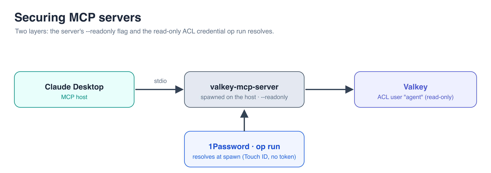

# Securing MCP servers

> Pointing an off-the-shelf MCP server at the same data, with 1Password securing *its* credential.

Part of **[What Your Agent Doesn't Know Can't Hurt You][series]**, a hands-on
series on keeping secrets out of an AI agent's reach.

---

The earlier steps hardened an agent *we* wrote: we owned the Valkey call, split
the PII, scoped the credential. In practice you'll reach for **off-the-shelf MCP
servers** you didn't write, and you can't bolt your guardrails onto someone else's
server. What you *can* do is keep its secret out of plaintext and hand it only a
least-privilege credential. That's this step.

Unlike the others, this one has **no app of its own**. The agent is an MCP host
([Claude Desktop] here), and the tool layer is the [AWS Labs Valkey MCP
server][valkey-mcp], a Valkey-native server you didn't write. The database is the
same Valkey from [the previous step][prev], reached with the same read-only,
PII-blind `agent` credential.

This server ships its *own* guardrail: a `--readonly` flag that disables every
write tool. So the credential isn't the only line of defense here; it's the
second one. We turn on `--readonly` **and** hand the server the read-only ACL
credential, two independent layers: forget the flag and the ACL still refuses the
write; mis-scope the ACL and `--readonly` still refuses it. Defense in depth,
with 1Password owning the credential either way.



## What you need

1. **The Valkey from [the previous step][prev]**, running. It provides the ACL and
   the seeded data. Check that branch out and bring it up (only Valkey is
   required).
2. **A `valkey-mcp` Server item** in the same `Agent Prod` vault. Everywhere else
   the client runs *inside* Compose and reaches Valkey as `valkey-prod`; here the
   MCP server runs on your host, spawned by Claude Desktop, so it reaches the same
   Valkey over the published port. This item carries that host-side address, the
   *same* read-only `agent` credential as before:

   | Field | Value |
   |-------|-------|
   | `host` | `127.0.0.1` |
   | `port` | `6379` |
   | `username` | `agent` |
   | `password` | the same agent password from the previous step |
3. **The [1Password desktop app][op-desktop]** with CLI integration enabled
   (*Settings > Developer > Integrate with 1Password CLI*). This lets `op run`
   authenticate by biometric, so **no token lives in the config**.
4. **[`uv`][uv]** on your `PATH`. The config launches the server with `uvx`, which
   fetches and runs `awslabs.valkey-mcp-server` on demand, so there's nothing to
   install ahead of time.

## The config (note what's *not* in it)

Add this to `~/Library/Application Support/Claude/claude_desktop_config.json`
(also saved in [`mcp/claude_desktop_config.json`](mcp/claude_desktop_config.json)):

```json
{
  "mcpServers": {
    "valkey": {
      "command": "/opt/homebrew/bin/op",
      "args": ["run", "--", "uvx", "awslabs.valkey-mcp-server@latest", "--readonly"],
      "env": {
        "VALKEY_HOST": "op://Agent Prod/valkey-mcp/host",
        "VALKEY_PORT": "op://Agent Prod/valkey-mcp/port",
        "VALKEY_USERNAME": "op://Agent Prod/valkey-mcp/username",
        "VALKEY_PWD": "op://Agent Prod/valkey-mcp/password",
        "MCP_LOG_FILE": "/tmp/valkey-mcp-server.log"
      }
    }
  }
}
```

The command isn't the MCP server; it's `op run --`, which resolves the `op://`
references in memory and hands the real values to the server it spawns. The
config holds **only references, no connection details**: not just the password,
but the host and port too, matching how every earlier branch keeps the whole
Valkey connection in the vault. `--readonly` is the server's own switch that
disables all write and admin tools; it rides in `args`, in the clear, because it
isn't a secret. The `op` path is absolute because Claude Desktop doesn't inherit
your shell `PATH`; set yours with `command -v op`. (The password key is
`VALKEY_PWD`, not `VALKEY_PASSWORD`; the server is particular about that one.)

Restart Claude Desktop and confirm the `valkey` server shows **running** under
*Settings > Developer*.

## See it work

Talk to Claude; it picks the Valkey MCP tools itself:

| You say | What happens |
| --- | --- |
| "Look up customer 1." | Business record returned ✅ |
| "What's their SSN?" | **Denied**: *No permissions to access a key* 🛑 |
| "Change their first name to HACKED." | **Denied**: no write tool is even exposed 🛑 |

The write attempt fails twice over: `--readonly` never exposes a write tool, and
even if it did, the `agent` ACL user has no write permission. Either layer alone
would stop it.

## The point

The Valkey MCP server exposes the **full Valkey command set** through a handful of
structured tools (`valkey_read`, `valkey_write`, `valkey_admin`). We hand it only
a read-only slice of that power twice: `--readonly` strips the write and admin
tools at the tool layer, and the least-privilege ACL credential strips them again
at the database. It could ask for anything and still can't read one SSN or change
one record, and the credential that scopes it was injected just in time by
1Password, never in plaintext.

And because that credential lives in the vault rather than the tool's config, it
stays disposable even here. If it leaks, you **rotate or revoke** it in 1Password
and the next `op run` picks up the change; the third-party server you can't edit
keeps working, now with a credential the old copy can no longer use. Control of
the secret never left the boundary 1Password owns.

**Use the tool's guardrails where they exist, and control the credential
regardless, because that's the layer you always own.**

## What this doesn't solve

The agent trusts whatever MCP server it points at, and the secret didn't vanish;
it relocated to a boundary 1Password owns. Security is never finished.

---

**← Previous: [Controlling the blast radius][prev] · [Series overview][series]**

[series]: https://github.com/riferrei/securing-agent-secrets-1password
[prev]: https://github.com/riferrei/securing-agent-secrets-1password/tree/controlling-blast-radius
[Claude Desktop]: https://claude.ai/download
[valkey-mcp]: https://github.com/awslabs/mcp/tree/main/src/valkey-mcp-server
[uv]: https://docs.astral.sh/uv/
[op-desktop]: https://1password.com/downloads
